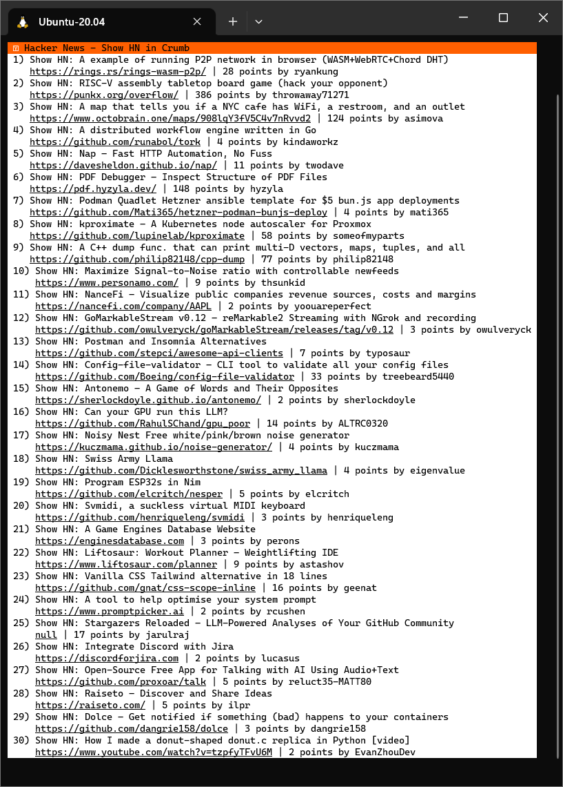

# Crumb Show HN
A simple Show HN Client, written in 93 lines of [Crumb](https://github.com/liam-ilan/crumb), using [colors.crumb](https://github.com/ronilan/colors.crumb), [jq](https://jqlang.github.io/jq/), and Crumb v0.0.2 shell integration.



## How To
First, clone this repository,
```bash
git clone https://github.com/liam-ilan/crumb-show-hn.git
```

If you do not have jq already, install it,
```bash
sudo apt install jq
```

Build the Crumb interpreter with,
```bash
chmod +x build-crumb.sh && ./build-crumb.sh
```

Now you're all set! Just do
```bash
./crumb main.crumb
```
to run the client!

## Credit
- (c) [Liam Ilan](https://www.liamilan.com/)
- Built using [colors.crumb](https://github.com/ronilan/colors.crumb)